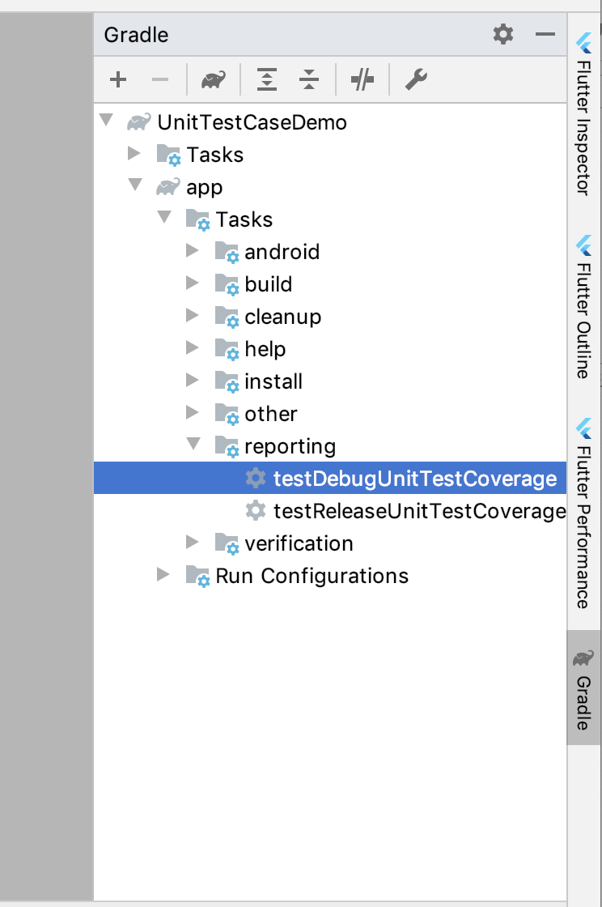
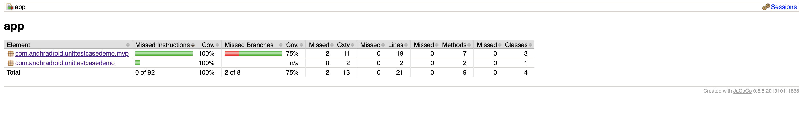

./gradlew build testDebugUnitTestCoverage

Run this `testDebugUnitTestCoverage`:

Find the reports in the below path:
`/app/build/reports/jacoco/testDebugUnitTestCoverage/html/index.html`

Gradle task to generate reports:
UnitTestCaseDemo>app>reporting>testDebugUnitTestCoverage

